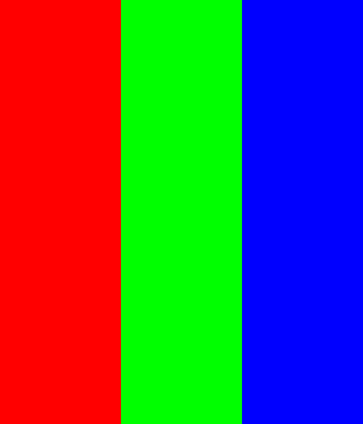

# x265

An application that can read raw images in rgb 8:8:8 format, convert them to raw hevc bit stream, and send them over UDP

To run:

```
./x265 --input /home/oosman/Downloads/rgb.data --input-res 700x600 --fps 30 --output udp://127.0.0.1:7878
./x265 --input /dev/screen --input-res 600x700 --fps 1 --output udp://127.0.0.1:7878
./x265 --input /dev/screen --input-res 1920x1080 --fps 1 --preset ultrafast --tune psnr --tune ssim --tune fastdecode  --tune zerolatency --output udp://127.0.0.1:7878
```

Sample images that can be used for streaming. These are in RGB 8:8:8 format

[](LagoonNebula-600x700.data)

[](rgb.data)

Run the  [x265gui](https://github.com/jambamamba/x265gui) first before running this x265 streamer

This repository is based off [https://github.com/strukturag/libde265](https://github.com/strukturag/libde265)


